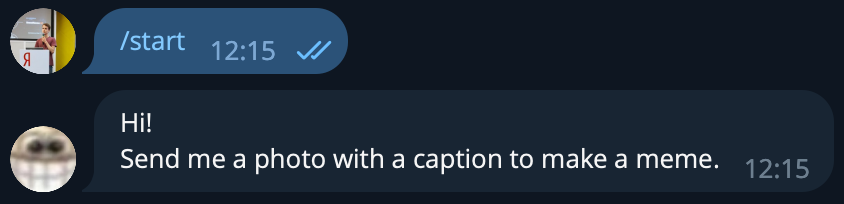
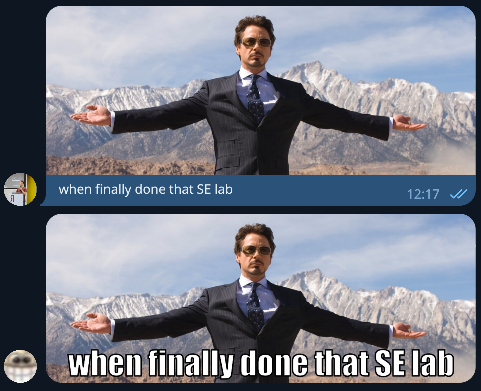

# Meme Creator Telegram Bot
| develop                                                                                                                            | master                                                                                                                           |
|------------------------------------------------------------------------------------------------------------------------------------|----------------------------------------------------------------------------------------------------------------------------------|
|  |  |

A bot for making up memes without leaving Telegram.

## What this bot can do?

This bot creates a meme from image and text sent by user.
Possible inputs are:

- `/start` — lets bot greet you:
  
- sending image with caption — the bot will try to generate a meme:
  

Any other input will be regarded as incorrect.

## Getting started

### Setting up credentials

First, provide your own [Meme Generation API](https://memebuild.com/api) and [Telegram bot](https://t.me/BotFather)
credentials.

For Meme Generation API key, set `MEME_API_TOKEN` environment variable.

For Telegram bot credentials, set `TELEGRAM_BOT_TOKEN` and `TELEGRAM_BOT_USERNAME` environment variables.

### Running with Docker

First, build the fat jar image:

```
docker build -t meme-creator-telegram-bot .
```

Then, run the application:

```
docker run --env-file env.list meme-creator-telegram-bot
```

### Running without Docker

First, build the fat jar image with Gradle:

```
./gradlew fatJar
```

Then, run the application:

```
java -jar ./build/libs/meme-creator-telegram-bot-$VERSION.jar
```
